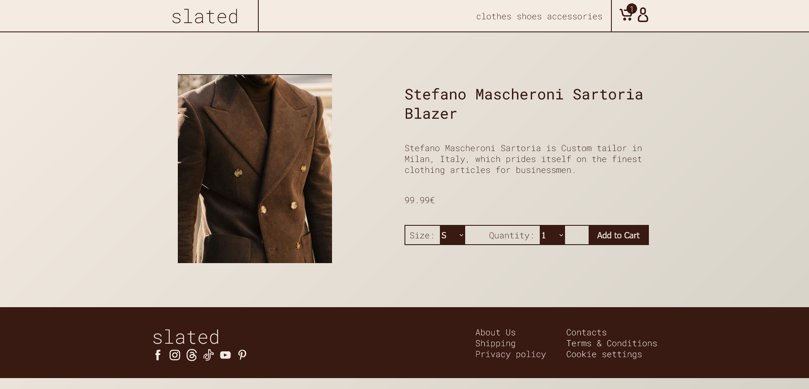

# Slated - clothing brand concept website

This is final JavaScript module project for my front-end course. The assignment was to create a CRUD application for an e-commerce business without a backend. The resulting project was created in a span of a week.

## Main requirements

1. Create a website for viewing an e-store's products. Store product objects must contain: id, name, price, image URL, product description, sell location. For creating API, https://mockapi.io/ was recommended.
2. Create a page for viewing products. Product card must contain an image, name and price. Pressing on the product redirects user to a page with a detailed description of the product.
3. Detailed product page must contain all of the information about the product. It should be possible to delete the product from this page. Additionally this page must contain a button for returning the the previous page.
4. Page for creating new products. This page must contain a form for creating new product records in the database. The form must contain minimal validation and notifying messages of validation and upload statuses must be displayed.

## Result

I created a clothing brand page *slated*. This is a e-commerce website for selling smart-casual clothing. With the page design I tried to reflect the feeling of smart-casual style. The style is indicative of formality, minimalism, yet carries the feeling of coziness.

Regarding the functionality of the e-store, I attempted to include as many important elements composing a typical e-commerce website. Smaller things include essential website elements such as: header for branding and containing navigation links, footer for socials, legal matters, and responsiveness to different screen sizes. Bigger things include:

1. Categories. User can browse the store by categories (or collections). While browsing the product page, URL parameters are used, which are extrapolated to determine current category and all items are filtered accordingly.
2. Dynamic clothing sizes. Each category of clothing have their own sizing system, like in real life. Shoes sizes are usually denoted by a number, while clothing by a letter or some other measurement. All of these can be edited to suit business requirements.
3. Cart for saving to-be-bought products. While in detailed product page, a user may add products to the cart by clicking "Add to cart" after selecting size and amount for clothing articles they wish to buy. Cart information is stored in the local storage, so while browsing the website, the cart state is preserved.   
4. "Buying" products. User may buy products, which sends a `PUT` request to the API, with the reduced amount of clothing articles. The received response from the API is checked, and if any of the products do not have any clothing particles left, the record for that product is deleted in the database.

## Shortcomings and mistakes

1. Full client-side control 

Although, the application was built with resilience in mind, it's still fully controlled by the user's browser, and with no real control over how API validates received data, the application can be easily exploited and broken. One may intercept HTTP request and edit requests to target any arbitrary API endpoint to edit any data.

2. No caching and loading screens

On every page load data is fetched from the backend API. This slows down application responsiveness. One shortcoming is the absence of loading screens. Loading screens would be a more elegant solution, than having and empty screen. Implementing loading screens is not difficult in itself, but the need for them was conceived way too late into the development and it would be a pricey refactor to implement loading in all of the pages.

3. Can't buy multiple sizes of the same product

4. Can't host on Github pages

Because I'm using an API, which I don't have control over. Endpoints could be extrapolated and used to upload arbitrary data without client-side sanitation and validation, which could lead to uploading malicious code. Even though, I tried to follow best practices for avoiding XSS, there's still a chance I could've slipped up somewhere. So to avoid users to being exposed to potentially malicious software, I chose to not host it.  

## Download and install

1. Clone the repository into your local environment
2. Host files on a server

### Python

Run this command in a shell to open a server for hosting files

`python3 -m http.server 8000`

### Live server extension

Serve with [Live Server](https://marketplace.visualstudio.com/items?itemName=ritwickdey.LiveServer) extension for Visual Studio Code

### Bundlers

Download [Parcel](https://parceljs.org/) or [Vite](https://vitejs.dev/) and follow docs for instructions on how to launch a server

### Backend server

Currently popular backend server frameworks:

- [Express](https://expressjs.com/)
- [GO](https://go.dev/)
- [Django](https://docs.djangoproject.com/en/5.0/)
- [Flask](https://flask.palletsprojects.com/en/3.0.x/quickstart/)

## Images

### Front page

### Products page

### Product view page

### Cart page

### Create new product page

